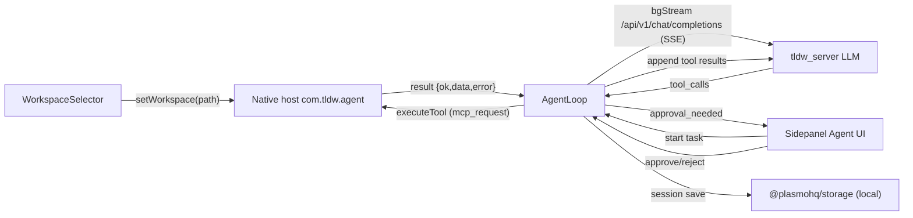

# PRD: Server-Hosted Agent Features

## Overview
Move agent features that currently rely on native messaging and local execution to tldw_server. The web frontend (and the extension) should call server APIs for workspace operations, file access, command execution, and MCP tools. All agent actions run on the server host, not on the user's local machine.

## Problem / Opportunity
Today, agent features depend on a native messaging host and local execution. This blocks a web frontend, adds install friction, and creates a split execution model. Hosting agent features on the server enables a single deployment surface and makes the web UI viable without a local agent.

## Current Implementation (Extension + Native Host)
- Entry point: sidepanel agent route `src/routes/sidepanel-agent.tsx` with UI components in `src/components/Agent/*` (WorkspaceSelector, ToolCallLog, DiffViewer, ApprovalBanner, TerminalOutput).
- Orchestration: `src/services/agent/agent-loop.ts` runs the loop, streams LLM responses from `/api/v1/chat/completions` via `bgStream`, builds tool calls, and appends tool results into the message history.
- Tool definitions: functions like `fs_list`, `search_grep`, `git_status`, and `exec_run` are defined in `src/services/agent/agent-loop.ts`. Tool name mapping to MCP names is handled by `mapToolName` in the same file.
- Approvals: tool tiers and approval logic live in `src/services/agent/types.ts` (`auto`, `batch`, `individual`) with settings such as `autoApproveWrites` and `autoApproveExec`.
- Execution transport: `src/services/native/native-client.ts` uses `browser.runtime.sendNativeMessage` to a native host named `com.tldw.agent`. It calls `mcp_list_tools` and `mcp_request` and exposes `executeTool`, `listTools`, and workspace helpers.
- Workspace selection: `src/components/Agent/WorkspaceSelector.tsx` validates and sets workspaces through the native host, persisting `agent:workspaces` and `agent:selectedWorkspace` in `@plasmohq/storage`.
- Session persistence: `src/services/agent/storage/*` stores session history and workspace usage for restore flows (used by `SessionHistoryPanel` and `SessionRestoreDialog`).
- Limitation: requires a native install, runs on the user's local filesystem, and only works in extension contexts (not in web-only deployments).

### Current-Flow Diagram


### Current Storage Keys (Exact)
- `agent:settings` (AgentSettings) via `useStorage` in `src/routes/sidepanel-agent.tsx`.
- `agent:workspaces` (Workspace[]) via `useStorage` in `src/components/Agent/WorkspaceSelector.tsx`.
- `agent:selectedWorkspace` (string | null) via `useStorage` in `src/components/Agent/WorkspaceSelector.tsx`.
- `agent:sessions` (StoredAgentSession[]) via `Storage({ area: "local" })` in `src/services/agent/storage/sessionStorage.ts`.
- `agent:activeSession` (ActiveSessionRef) via `Storage({ area: "local" })` in `src/services/agent/storage/sessionStorage.ts`.
- `agent:workspaceHistory` (WorkspaceHistoryEntry[]) via `Storage({ area: "local" })` in `src/services/agent/storage/workspaceHistory.ts`.

### Current Event Types (Agent Loop)
`AgentEvent` union from `src/services/agent/types.ts`:

```ts
{ type: "step_start"; step: number }
{ type: "llm_start" }
{ type: "llm_chunk"; content: string }
{ type: "llm_complete"; content: string; tool_calls?: ToolCall[] }
{ type: "tool_start"; tool_call: ToolCall }
{ type: "tool_complete"; tool_call_id: string; result: any }
{ type: "approval_needed"; approvals: PendingApproval[] }
{ type: "complete"; result: AgentResult }
{ type: "error"; error: string }
```

### Current Payload Shapes
LLM tool call payload (`ToolCall`):

```ts
{
  id: string
  type: "function"
  function: {
    name: string
    arguments: string // JSON string
  }
}
```

Pending approval (`PendingApproval`):

```ts
{
  toolCallId: string
  toolName: string
  args: Record<string, any>
  tier: "auto" | "batch" | "individual"
  status: "pending" | "approved" | "rejected"
}
```

Tool result appended to conversation (`AgentMessage` with role `tool`):

```ts
{
  role: "tool"
  tool_call_id: string
  content: JSON.stringify({ ok: boolean, data?: any, error?: string })
}
```

Native messaging shapes (from `src/services/native/native-client.ts`):

```ts
// Request
{
  id: string
  type: "ping" | "config" | "mcp_request" | "mcp_list_tools"
  payload?: {
    method: "tools/call"
    tool_name: string
    arguments: Record<string, any>
  }
}

// Response
{
  id: string
  ok: boolean
  data?: any
  error?: { code: string; message: string }
  streaming?: boolean
}
```

MCP tool definitions returned by `listTools()`:

```ts
{
  name: string
  description: string
  parameters: Record<string, any>
  tier: "read" | "write" | "exec"
}[]
```

### Current Tool Mapping and Approval Tiers
LLM tool name -> MCP tool name mapping (from `mapToolName` in `src/services/agent/agent-loop.ts`):

```
fs_list -> fs.list
fs_read -> fs.read
fs_write -> fs.write
fs_apply_patch -> fs.apply_patch
fs_mkdir -> fs.mkdir
fs_delete -> fs.delete
search_grep -> search.grep
search_glob -> search.glob
git_status -> git.status
git_diff -> git.diff
git_log -> git.log
git_branch -> git.branch
git_add -> git.add
git_commit -> git.commit
exec_run -> exec.run
```

Approval tiers (from `TOOL_TIERS` in `src/services/agent/types.ts`):

```
auto: workspace.list, workspace.pwd, workspace.chdir, fs.list, fs.read, search.grep, search.glob, git.status, git.diff, git.log, git.branch
batch: fs.write, fs.apply_patch, fs.mkdir, git.add, git.commit
individual: fs.delete, exec.run, git.push
```

### Current Session Persistence Shapes (Storage)
Stored session shape (from `src/services/agent/storage/types.ts`):

```ts
{
  schemaVersion: number
  id: string
  workspaceId: string
  task: string
  title: string
  status: AgentStatus
  currentStep: number
  messages: StoredAgentMessage[]
  toolCalls: StoredToolCallEntry[]
  pendingApprovals: StoredPendingApproval[]
  diffs: StoredFileDiff[]
  executions: StoredCommandExecution[]
  createdAt: string
  updatedAt: string
}
```

## Goals
- G1: Remove the native messaging requirement for agent features.
- G2: Provide server APIs for workspace selection, file IO, search, and patching.
- G3: Provide server-side command execution with streaming output and strict guardrails.
- G4: Provide server-side MCP tool listing and execution.
- G5: Preserve a clear approval and audit trail for all agent actions.

## Non-Goals
- N1: Running tools on the user's local machine.
- N2: Browser integration (tabs, DOM capture, sidepanel, context menus).
- N3: Remote desktop or shell access beyond defined allowlists.
- N4: Multi-server orchestration in v1.

## Users
- Admins who configure allowed workspaces and command allowlists.
- Standard users who run agent tasks against server-hosted projects.

## Scope and Requirements

### Functional Requirements
- FR1: Agent availability indicator in the UI (online, offline, degraded).
- FR2: Workspace management on server:
  - List allowed workspace roots.
  - Select an active workspace per session.
  - Validate paths against allowed roots.
- FR3: File operations:
  - Read, write, list, search, delete, and apply patch.
  - Safe limits for file size and directory traversal.
- FR4: Command execution:
  - Allowlisted commands only.
  - Stream stdout and stderr.
  - Return exit codes and duration.
  - Support cancellation and timeouts.
- FR5: MCP tools:
  - List tools and execute with arguments.
  - Stream tool output when available.
- FR6: Session and audit:
  - Record tool usage, approvals, and outcomes per user.
  - Expose minimal history for troubleshooting.

### UX Requirements
- Show a clear banner: "Actions run on the server host."
- Workspace selector uses server-defined workspace list.
- Approval prompts identify the command, args, and workspace.

## Proposed API Surface (Draft)
- GET /api/v1/agent/workspaces
- POST /api/v1/agent/workspace/select
- GET /api/v1/agent/fs/list?path=
- GET /api/v1/agent/fs/read?path=
- POST /api/v1/agent/fs/write
- POST /api/v1/agent/fs/patch
- POST /api/v1/agent/fs/search
- POST /api/v1/agent/exec (stream via SSE or WebSocket)
- GET /api/v1/agent/mcp/tools
- POST /api/v1/agent/mcp/call
- GET /api/v1/agent/sessions/{id}

## Data Model (Server)
- AgentSession: id, user_id, workspace, created_at, last_used_at, status
- AgentAudit: user_id, action, target, approved, timestamp, outcome
- Workspace: id, name, root_path, allowed_commands, created_at

## Security and Guardrails
- Enforce workspace root sandboxing.
- Strict command allowlist and argument validation.
- Rate limits, max output size, and timeouts.
- Audit logging for every action.
- RBAC: admin controls workspace roots and allowlists.

## Dependencies
- tldw_server: new agent module + APIs + streaming.
- Auth: existing token or session auth used for agent endpoints.
- UI: replace native messaging client with server API client.

## Risks and Mitigations
- Risk: Users assume local file access.
  - Mitigation: explicit UI copy and onboarding messaging.
- Risk: Server command execution is sensitive.
  - Mitigation: allowlist, audit logs, and RBAC.
- Risk: Large file operations degrade server performance.
  - Mitigation: size limits and async processing for large tasks.

## Success Metrics
- >= 95% of agent actions succeed without local agent.
- < 1% of agent actions fail due to permissions after onboarding.
- Zero security incidents attributable to agent execution.

## Rollout Plan
- Phase 1: read-only tools (list/read/search).
- Phase 2: write and patch.
- Phase 3: exec and MCP tools.
- Phase 4: deprecate native messaging (optional, after adoption).

## Open Questions
- Where is the server workspace allowlist configured (env, admin UI)?
- Which commands are in the default allowlist?
- What is the retention policy for audit logs and session history?
- Should agent APIs be disabled by default in production?
